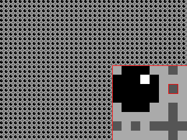

# pades

## description
pades (*PAttern DESigner*) is a tool for designing old style, 2-bit desktop patterns. If you remember desktop patterns of MS Windows 95, then you do not need further explanation. If you don't, simply try this application.

The tool was created with handhelds in mind. Using it on a PC may be a little awkward, but it is possible.
